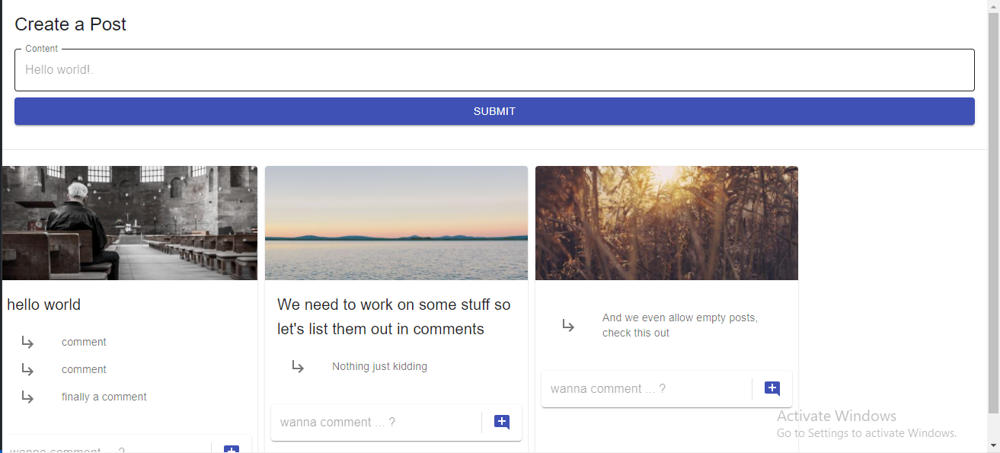

# MicroServices Small demo

## Intro

A simple site that provides the following features

1. Creating a post
2. adding a comment on a given post
3. Anybody can post or comment anonymously so no authorization or user info

## Services

### interaction between services

* An additional service called `event` is added to act as an event bus.  
* Any service that has an event that other services may be interested to know about would send it to `/event` route of the event service.  
* The event service simply proadcasts all events it receives to all services through a `/event` route that all services have.
* When a service receives an event, it imspects its type to judge if it needs to react to it or not, and proceed from there.

### API

1. Post service
   * **Port**: 4000
   * **routes**:
      * | **path** | `Post:/` |  
        |-|-|
        | **job** | create a new post |  
        | **body** | {content: string} |  
        | **reponse** | Post object created |  
   * **Events of intesert**: None
   * **Events emitted**:
     * *Post Created*: {type: `'postCreated'`, content: {id, content}}

2. Comment service
   * **Port**: 4001
   * **routes**:
      * | **path** | `Post:/posts/:id` |
        |------|-------------------|
        | **job** | create a new comment on the post with give id |  
        | **body** | {content: string} |  
        | **reponse** | Post object created |  
   * **Events of intesert**:
     * *post created*
     * *Comment moderated*
   * **Events emitted**:
     * *Comment created*: {type: `'commentCreated'`, content: {postId, id, content, status}}
     * *Comment updated*: {type: `'commentUpdated'`, content: {postId, id, content, status}}

3. Query service
   * **Port**: 4002
   * **routes**:
      * | **path** | `Get:/` |
        |-|-|
        | **job** | Get all posts and their comments |
        | **body** | {content: string} |  
        | **reponse** | [{id, content, comments: {id, content}}] |
   * **Events of intesert**:
     * *post created*
     * *Comment created*
     * *Comment updated*
   * **Events emitted**: None

4. Moderation service
   * **Port**: 4100
   * **routes**: No routes
   * **Events of intesert**:
     * *Comment created*
   * **Events emitted**:
     * *Comment moderated*: {type: `'commentModerated'`, content: {postId, id, content, status}}

## Notes

This project is focused on the idea of microservices (even though we don't even do microservices, but anyway), so we didn't give much focus on appearance or minor details like:

1. You need to refresh for posts and comments you just created to appear.
2. All data are stored in memory not a database, so if one goes down it would lose all data, this may be a problem, since comment service keeps track of old post ids (to make sure you only comment on existing posts), if it went down, it wouldn't remember the currently existing posts and would only allow you to comment on newly added posts, additionally, if query service went down, we lose basically lose all data we send to the user, those are problems with the type of "database" we use, not the microservices idea itself.
3. We don't do error handling in routes, so the communication between services and event bus is assumed to be always successful, if for any reason this communicatio doesn't work, the event bus would fail and so will the whole system, the microservices approach is a `one point of failure`, if the event bus goes down the whole system would have a critical problem, although all services would work well if they have error handling, their communication would be cut and their activities may not be consistent with one another (e.g. can't comment on an existing post).
